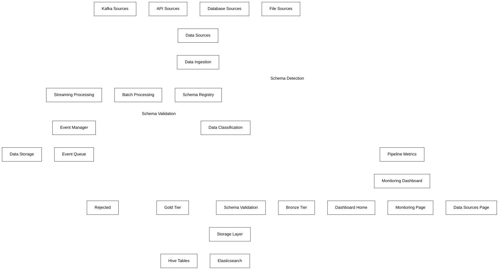

# PySpark Data Ingestion and Classification System

A robust, scalable data ingestion and classification system built with PySpark for processing multi-source data in a Cloudera environment. This system features real-time streaming capabilities, automated data quality classification, and a comprehensive web dashboard for monitoring.

## 🚀 Features

- **Multi-source Data Ingestion**: Process data from files, databases, APIs, and Kafka streams
- **Real-time Streaming**: Support for both batch and real-time streaming processing
- **Data Classification**: Automatic classification into Bronze, Silver, and Gold tiers based on data quality
- **Schema Registry**: Dynamic schema validation and evolution capabilities
- **Elastic Stack Integration**: Full integration with Elasticsearch for data storage and Kibana for visualization
- **Web Dashboard**: Comprehensive monitoring dashboard
- **Event-driven Architecture**: Complete event system for asynchronous processing

## 📋 System Architecture

The system is built with a modular architecture organized into the following components:

### Data Sources

- **File Connector**: Process CSV, JSON, Parquet and other file formats
- **Database Connector**: Connect to SQL and NoSQL databases with security controls
- **API Connector**: Consume data from REST APIs with authentication and pagination support
- **Kafka Connector**: Process real-time streams with exactly-once semantics

### Processing Pipeline

- **Data Ingestion**: Central orchestration component managing all data intake
- **Batch Processing**: Process large volumes of historical data
- **Streaming Processing**: Real-time data processing as events arrive
- **Event Manager**: Coordinate asynchronous event handling across the system
- **Schema Registry**: Central repository for schema validation and evolution

### Data Classification

- **Quality Assessment**: Evaluate data completeness, accuracy, and timeliness
- **Bronze Tier**: Raw, minimally validated data preserving original format
- **Silver Tier**: Cleansed, validated data with good quality
- **Gold Tier**: Highest quality data, fully validated and ready for analysis

### Web Dashboard

- **Pipeline Monitoring**: Comprehensive dashboards for system monitoring
- **Data Source Status**: Connection health and processing metrics
- **Classification Metrics**: Distribution and quality metrics visualization
- **Schema Management**: Schema history and evolution tracking
- **Event Log**: System events and data processing tracking

## 🔍 Data Flow Diagram



## 📂 Project Structure

```
├── config/
│   ├── data_sources.yml          # Configuration for data sources
│   └── logging_config.yml        # Logging configuration
│
├── logs/                         # Directory for log files
│
├── schemas/                      # Schema definitions
│   ├── customer_data.json        # Schema for customer data
│   └── sales_transactions.json   # Schema for sales transactions
│
├── src/
│   ├── classifiers/              # Data classification components
│   │   ├── __init__.py
│   │   └── data_classifier.py    # Classifies data into bronze/silver/gold tiers
│   │
│   ├── connectors/               # Data source connectors
│   │   ├── __init__.py
│   │   ├── api_connector.py      # API-based data source connector
│   │   ├── base_connector.py     # Base class for all connectors
│   │   ├── database_connector.py # Database connector
│   │   ├── elasticsearch_connector.py # Elasticsearch connector
│   │   ├── file_connector.py     # File-based connector
│   │   └── kafka_connector.py    # Kafka streaming connector
│   │
│   ├── pipeline/                 # Pipeline processing logic
│   │   ├── __init__.py
│   │   └── data_ingestion_pipeline.py  # Core pipeline implementation
│   │
│   └── utils/                    # Utility functions
│       ├── __init__.py
│       ├── config_loader.py      # Loads configuration from YAML
│       ├── kafka_utils.py        # Kafka-specific utilities
│       ├── logging_utils.py      # Logging setup and utilities
│       ├── schema_registry.py    # Schema validation and evolution
│       └── spark_session.py      # PySpark session management
│
├── web_dashboard/                # Web dashboard for monitoring
│   ├── static/
│   │   ├── assets/
│   │   │   └── diagram.svg       # Architecture diagram
│   │   ├── css/
│   │   │   └── custom.css        # Custom styling
│   │   └── js/
│   │       ├── dashboard.js      # Dashboard functionality
│   │       └── realtime.js       # Real-time event handling
│   │
│   ├── templates/
│   │   ├── base.html             # Base template
│   │   ├── data_sources.html     # Data sources view
│   │   ├── index.html            # Dashboard home
│   │   ├── monitoring.html       # Monitoring page
│   │   └── schema_validation.html # Schema validation page
│   │
│   ├── app.py                    # Flask web application
│   └── main.py                   # Dashboard entry point
│
├── main.py                       # Main application entry point
└── pyproject.toml                # Python project configuration
```

## 🔧 Component Details

### 1. Data Sources Layer

- **File Sources**:
  - Handles CSV, JSON, Parquet, and other file formats
  - Processes both local and remote files (HDFS, S3)
  - Supports batch processing of file collections

- **Database Sources**:
  - Connects to SQL and NoSQL databases
  - Supports JDBC connections for most major databases
  - Handles secure connections with credential management

- **API Sources**:
  - Consumes data from REST APIs
  - Handles authentication, pagination, and rate limiting
  - Supports webhook-based push notifications

- **Kafka Sources**:
  - Connects to Kafka streams for real-time data
  - Manages consumer groups and offsets
  - Provides exactly-once processing semantics

### 2. Data Processing Layer

- **Data Ingestion**:
  - Central orchestration component for data intake
  - Routes data to appropriate processing paths
  - Manages source connections and configurations

- **Batch Processing**:
  - Handles large volumes of static data
  - Processes data in fixed chunks or windows
  - Optimized for throughput over latency

- **Streaming Processing**:
  - Processes data in real-time as it arrives
  - Uses Spark Structured Streaming or event-based approach
  - Optimized for low latency responses

- **Event Manager**:
  - Coordinates asynchronous event processing
  - Manages event subscriptions and routing
  - Ensures fault tolerance for event handling

- **Event Queue**:
  - In-memory or persistent queue for event processing
  - Implements producer-consumer pattern for events
  - Ensures ordered delivery of events when required

- **Schema Registry**:
  - Central repository for data schemas
  - Manages schema versions and evolution
  - Validates data against registered schemas
  - Publishes schema-related events

### 3. Data Classification Layer

- **Data Classification**:
  - Evaluates data quality based on multiple metrics
  - Applies rules and thresholds for classification
  - Uses schema validation as part of classification

- **Bronze Tier**:
  - Raw, unprocessed data with minimal validation
  - Preserves original format and content
  - Used as a staging area for further processing

- **Silver Tier**:
  - Cleansed, validated data with good quality
  - Standardized format and structure
  - May have some derived or enriched fields

- **Gold Tier**:
  - Highest quality data ready for analysis
  - Fully validated against schema and business rules
  - May include aggregations and derived metrics

- **Rejected**:
  - Data that fails critical validation checks
  - Stored separately for analysis and debugging
  - Contains detailed error information

### 4. Web Dashboard Layer

- **Web Dashboard**:
  - Main web interface for system monitoring
  - Implemented in Flask using Bootstrap
  - Serves static and dynamic content using standard Flask routing

- **Dashboard Home**:
  - Overview and system status page
  - Shows key metrics and health indicators
  - Provides quick access to other dashboard sections

- **Monitoring Page**:
  - Detailed monitoring and metrics visualization
  - Shows real-time system performance
  - Displays classification distribution charts

- **Data Sources Page**:
  - Lists all configured data sources
  - Shows connection status and health
  - Displays source-specific metrics

- **Schema Validation**:
  - Shows schema registry contents
  - Displays schema versions and evolution history
  - Provides validation statistics

- **Event Log**:
  - Display of system events
  - Shows data processing events
  - Filters events by type and source

- **Metrics Summary**:
  - Aggregated system metrics
  - Shows KPIs for data processing
  - Displays throughput and latency metrics

## 🚦 Processing Modes

### Batch Processing

Batch processing mode is designed for handling large volumes of historical data or data that is processed at regular intervals. This mode prioritizes throughput over latency and is suitable for:

- Historical data loading
- End-of-day/week/month processing
- Large-scale data transformations

### Streaming Processing

Streaming mode is designed for real-time data processing with two sub-modes:

1. **Spark Structured Streaming**:
   - Higher throughput for large volumes of streaming data
   - Windowed operations and stateful processing
   - Suitable for complex transformations on streams

2. **Event-Based Processing**:
   - Lower latency for immediate event handling
   - Simpler implementation for direct event consumption
   - Better for real-time dashboards and notifications

## 📊 Data Quality Metrics

The system classifies data based on the following quality metrics:

- **Completeness**: Percentage of non-null values
- **Accuracy**: Conformance to expected patterns and value ranges
- **Timeliness**: Recency of data relative to expected update frequency
- **Schema Compliance**: Adherence to registered schemas
- **Consistency**: Internal consistency of relationships and values

## 🌐 Web Dashboard Features

- **System Monitoring**: Comprehensive system status and metrics visualization
- **Data Source Status**: Connection health and processing metrics
- **Quality Metrics Visualization**: Charts showing quality distribution
- **Schema Registry Interface**: Browse and manage schemas
- **Event Log**: System events and data processing logs
- **Responsive Design**: Works on desktop and mobile devices

## 📊 Elasticsearch & Kibana Integration

- **Data Storage**: Classified data (bronze, silver, gold, rejected) is stored in dedicated Elasticsearch indices
- **Date-based Indices**: Data is organized in time-based indices for efficient retention management
- **Metrics Tracking**: Pipeline metrics are stored in Elasticsearch for long-term trend analysis
- **Kibana Dashboards**: Pre-configured Kibana dashboards for:
  - Pipeline Overview: High-level metrics and system performance
  - Data Quality Metrics: Detailed quality distribution and trends
  - Source Monitoring: Per-source performance and health metrics
- **Real-time Visualization**: Real-time updates to dashboards as data is processed
- **Query Capabilities**: Advanced search and query capabilities through Elasticsearch's query DSL
- **Index Lifecycle Management**: Automated management of index retention and archiving

## 🛠️ Setup and Usage

### Prerequisites

- Python 3.8+
- Apache Spark 3.0+
- Kafka (for streaming features)
- Elasticsearch 7.x+ (for data storage and indexing)
- Kibana 7.x+ (for advanced visualization and dashboards)
- PostgreSQL or other database (optional)

### Installation

1. Clone the repository
2. Install dependencies: `pip install -r requirements.txt`
3. Configure data sources in `config/data_sources.yml`
4. Set up logging in `config/logging_config.yml`

### Running the System

#### Batch Mode

```bash
python main.py --config ./config/data_sources.yml
```

#### Streaming Mode

```bash
python main.py --streaming --trigger-interval "10 seconds"
```

#### Event-Based Streaming

```bash
python main.py --streaming --event-mode
```

#### Web Dashboard Only

```bash
python main.py --web-only
```

#### Process Specific Source

```bash
python main.py --source source_name
```

## 📈 Performance Considerations

- **Memory Management**: Adjust Spark executor memory based on data volume
- **Parallelism**: Configure partition count for optimal parallelism
- **Checkpointing**: Enable for fault-tolerant streaming
- **Backpressure**: Handle with appropriate trigger intervals
- **Caching**: Use for frequently accessed datasets

## 🔒 Security Features

- **Connection Security**: Support for SSL/TLS for database and API connections
- **Authentication**: Multiple authentication methods for various sources
- **Credential Management**: Environment variable and secure storage options
- **Audit Logging**: Comprehensive logging of access and operations

## 🧩 Extending the System

### Adding New Data Sources

1. Create a new connector class inheriting from `BaseConnector`
2. Implement required methods: `connect()`, `read_data()`, etc.
3. Register the connector in the pipeline

### Adding New Quality Metrics

1. Extend the `DataClassifier` class
2. Add new metric calculation methods
3. Update the classification thresholds in configuration

### Creating Custom Visualizations

1. Add new routes to the Flask application
2. Create new templates with visualization components
3. Add JavaScript for dynamic data loading and display

## 📝 License

This project is licensed under the MIT License - see the LICENSE file for details.

## 🤝 Contributing

Contributions are welcome! Please feel free to submit a Pull Request.